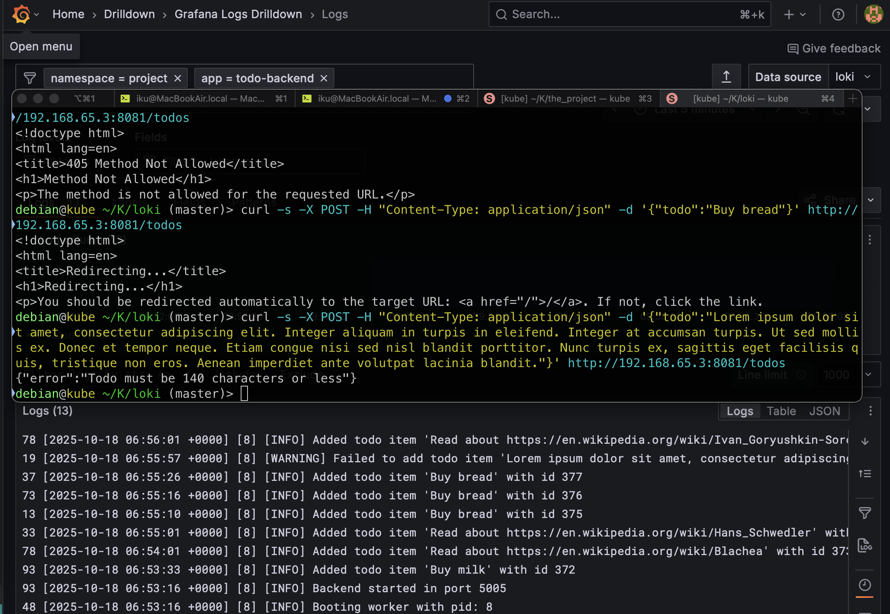

## Install monitoring stack

Installing granafa/loki/promtail by following course instruction resulted in Grafana showing error "Log volume has not been configured". This can be fixed by enabling it, althought it should be enabled by default:

```sh
loki:
  config:
    limits_config:
      volume_enabled: true
```

```sh
helm upgrade --install loki --namespace=loki-stack grafana/loki-stack --set loki.image.tag=2.9.3 --values values.yaml
```

## Example of log output in Grafana


